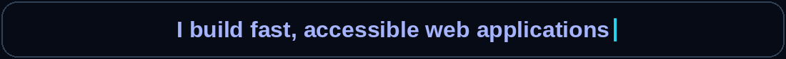
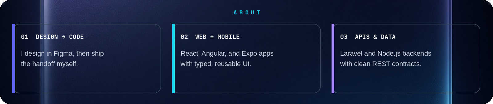
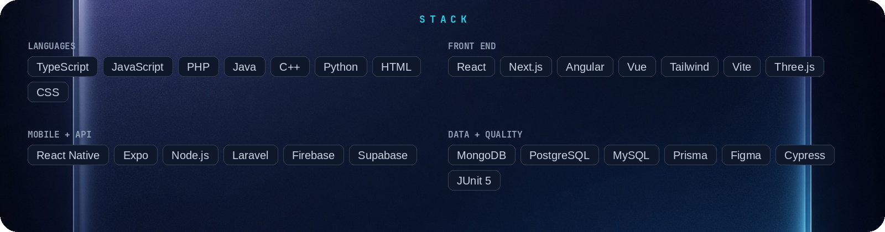
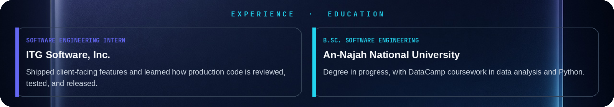
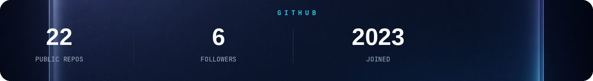

  
    
  
   
  
    
  
  
  
  
   
  
  
   
  
   
  

<table width="100%">
  <tr>
    <td width="50%" valign="top">
      
      
    </td>
    <td width="50%" valign="top">
      
    </td>
  </tr>
  <tr>
    <td width="50%" valign="top">
      
      
    </td>
    <td width="50%" valign="top">
      
      
    </td>
  </tr>
  <tr>
    <td width="50%" valign="top">
      
      
    </td>
    <td width="50%" valign="top">
      
      
    </td>
  </tr>
  <tr>
    <td width="50%" valign="top">
      
      
    </td>
    <td width="50%" valign="top">
      
    </td>
  </tr>
  <tr>
    <td width="50%" valign="top">
      
    </td>
    <td width="50%" valign="top">
      
    </td>
  </tr>
  <tr>
    <td width="50%" valign="top">
      
      
    </td>
    <td width="50%" valign="top">
      
    </td>
  </tr>
  <tr>
    <td width="50%" valign="top">
      
    </td>
    <td width="50%" valign="top">
      
    </td>
  </tr>
  <tr>
    <td width="50%" valign="top">
      
      
    </td>
    <td width="50%" valign="top">
      
    </td>
  </tr>
  <tr>
    <td width="50%" valign="top">
      
    </td>
    <td width="50%" valign="top">
      
    </td>
  </tr>
  <tr>
    <td width="50%" valign="top">
      
    </td>
    <td width="50%" valign="top">
      
    </td>
  </tr>
</table>

   
  
  
   
  
   
  

