

  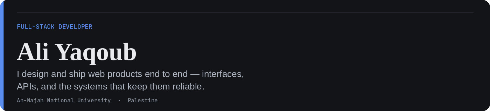

 

### About

Software Engineering student at **An-Najah National University**. I take products from Figma to production — typed interfaces, accessible UI, and the APIs behind them.

I care about clean component architecture, readable API design, and shipping work that holds up in review.

 

### Stack

**Languages & frameworks**

  

 

**Product & tooling**

  

  Also shipping with <b>Expo</b>, <b>React Native</b>, <b>Prisma</b>, and <b>JUnit 5</b>

 

### Selected work

<table width="100%">
  <tr>
    <td width="50%" valign="top">
      <a href="https://github.com/ali-yaqoup/Ali-Portfolio">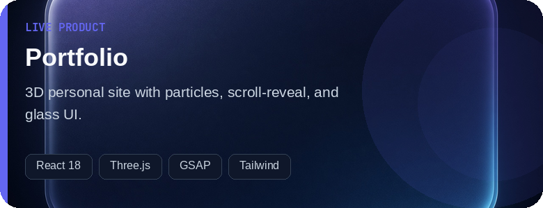</a>
      

        <a href="https://ali-yaqoup.github.io/Ali-Portfolio/">Live site</a>
        ·
        <a href="https://github.com/ali-yaqoup/Ali-Portfolio">Repository</a>
      

    </td>
    <td width="50%" valign="top">
      <a href="https://github.com/ali-yaqoup/twist-store">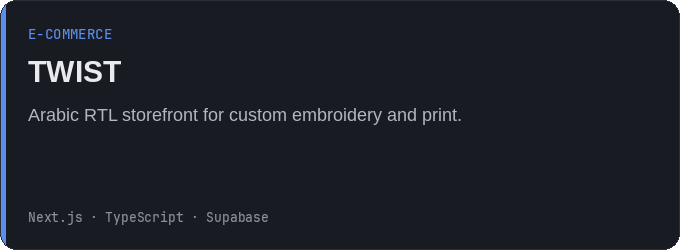</a>
      
<a href="https://github.com/ali-yaqoup/twist-store">Repository</a>

    </td>
  </tr>
  <tr>
    <td width="50%" valign="top">
      <a href="https://github.com/ali-yaqoup/FATEKIT">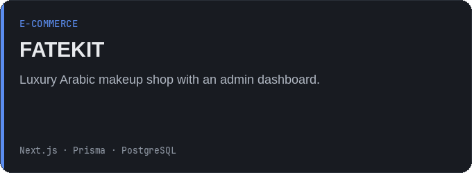</a>
      

        <a href="https://fatekitwebsite.vercel.app">Live site</a>
        ·
        <a href="https://github.com/ali-yaqoup/FATEKIT">Repository</a>
      

    </td>
    <td width="50%" valign="top">
      <a href="https://github.com/ali-yaqoup/landing-page">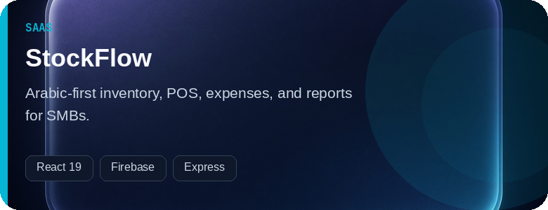</a>
      

        <a href="https://landingpage-pi-silk.vercel.app">Live site</a>
        ·
        <a href="https://github.com/ali-yaqoup/landing-page">Repository</a>
      

    </td>
  </tr>
  <tr>
    <td width="50%" valign="top">
      <a href="https://github.com/ali-yaqoup/restaurant-menu-template">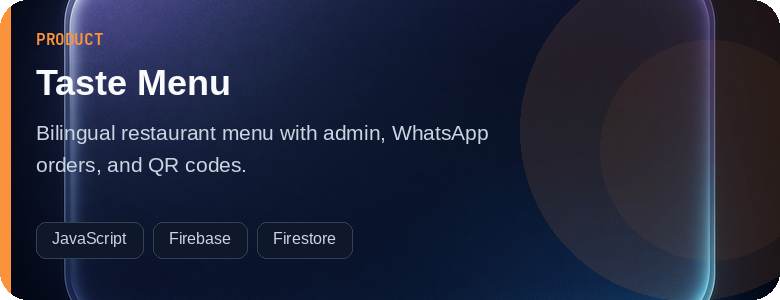</a>
      

        <a href="https://restaurant-menu-template-bice.vercel.app">Live site</a>
        ·
        <a href="https://github.com/ali-yaqoup/restaurant-menu-template">Repository</a>
      

    </td>
    <td width="50%" valign="top">
      <a href="https://github.com/ali-yaqoup/king-pizza-menu">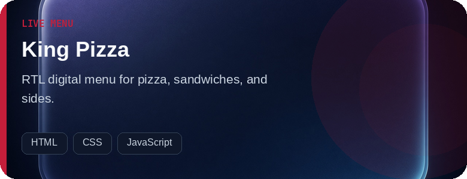</a>
      

        <a href="https://king-pizza-menu.vercel.app">Live site</a>
        ·
        <a href="https://github.com/ali-yaqoup/king-pizza-menu">Repository</a>
      

    </td>
  </tr>
  <tr>
    <td width="50%" valign="top">
      <a href="https://github.com/ali-yaqoup/thp-hiring-platform-web">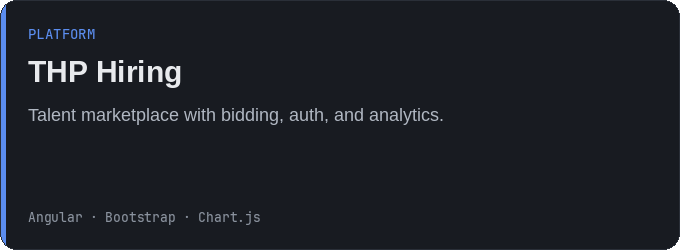</a>
      

        <a href="https://ali-yaqoup.github.io/thp-hiring-platform-web/">Live site</a>
        ·
        <a href="https://github.com/ali-yaqoup/thp-hiring-platform-web">Repository</a>
      

    </td>
    <td width="50%" valign="top">
      <a href="https://github.com/ali-yaqoup/thp-hiring-platform-api">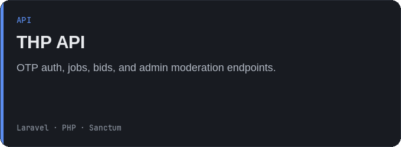</a>
      
<a href="https://github.com/ali-yaqoup/thp-hiring-platform-api">Repository</a>

    </td>
  </tr>
  <tr>
    <td width="50%" valign="top">
      <a href="https://github.com/ali-yaqoup/lumixy-mobile">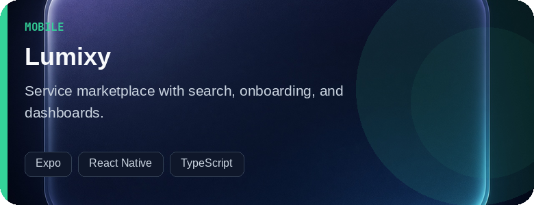</a>
      
<a href="https://github.com/ali-yaqoup/lumixy-mobile">Repository</a>

    </td>
    <td width="50%" valign="top">
      <a href="https://github.com/ali-yaqoup/lumixy-api">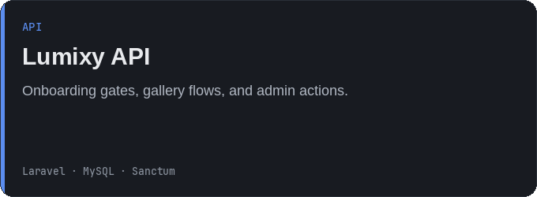</a>
      
<a href="https://github.com/ali-yaqoup/lumixy-api">Repository</a>

    </td>
  </tr>
  <tr>
    <td width="50%" valign="top">
      <a href="https://github.com/ali-yaqoup/ecoswap-cart-checkout-vue">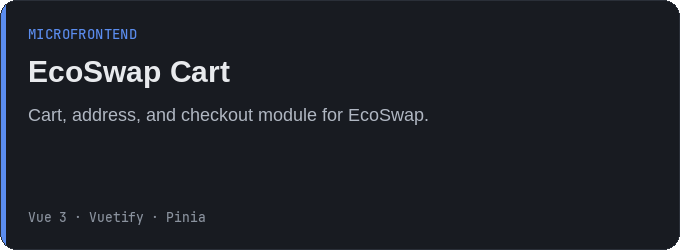</a>
      

        <a href="https://ecoswap-cart-checkout-vue.netlify.app/">Live site</a>
        ·
        <a href="https://github.com/ali-yaqoup/ecoswap-cart-checkout-vue">Repository</a>
      

    </td>
    <td width="50%" valign="top">
      <a href="https://github.com/ali-yaqoup/ecoswap-shell.">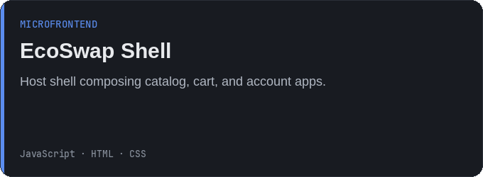</a>
      
<a href="https://github.com/ali-yaqoup/ecoswap-shell.">Repository</a>

    </td>
  </tr>
  <tr>
    <td width="50%" valign="top">
      <a href="https://github.com/ali-yaqoup/Graduation-Book">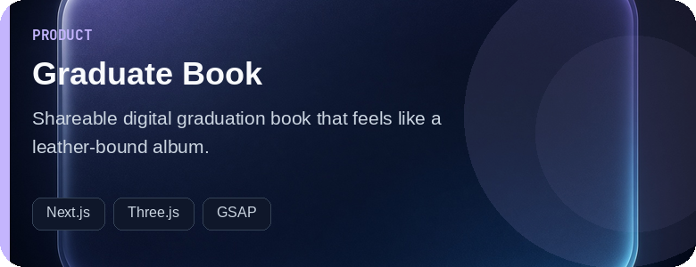</a>
      
<a href="https://github.com/ali-yaqoup/Graduation-Book">Repository</a>

    </td>
    <td width="50%" valign="top">
      <a href="https://github.com/ali-yaqoup/react-firebase-dashboard">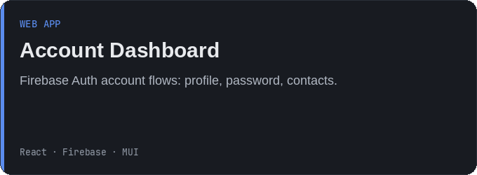</a>
      
<a href="https://github.com/ali-yaqoup/react-firebase-dashboard">Repository</a>

    </td>
  </tr>
  <tr>
    <td width="50%" valign="top">
      <a href="https://github.com/ali-yaqoup/time4meds-ui-design">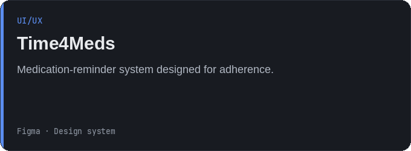</a>
      

        <a href="https://www.behance.net/gallery/211753891/Time4Meds-(Ui-Ux)">Case study</a>
        ·
        <a href="https://github.com/ali-yaqoup/time4meds-ui-design">Repository</a>
      

    </td>
    <td width="50%" valign="top">
      <a href="https://github.com/ali-yaqoup/skyline-auth-module">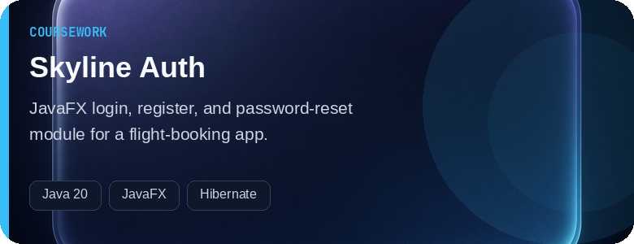</a>
      
<a href="https://github.com/ali-yaqoup/skyline-auth-module">Repository</a>

    </td>
  </tr>
  <tr>
    <td width="50%" valign="top">
      <a href="https://github.com/ali-yaqoup/qa-junit5-testing">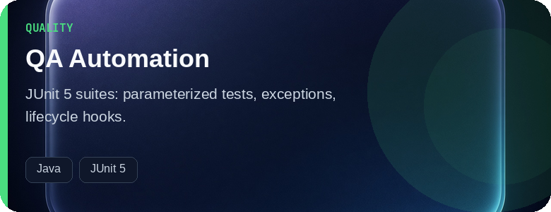</a>
      
<a href="https://github.com/ali-yaqoup/qa-junit5-testing">Repository</a>

    </td>
    <td width="50%" valign="top">
      <a href="https://github.com/ali-yaqoup/data-structures-cpp">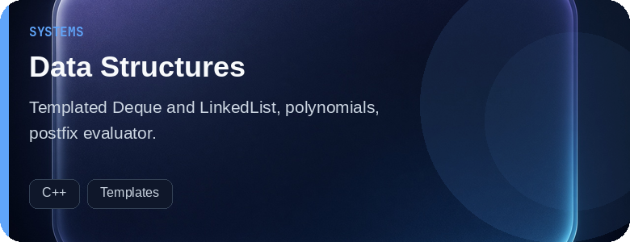</a>
      
<a href="https://github.com/ali-yaqoup/data-structures-cpp">Repository</a>

    </td>
  </tr>
  <tr>
    <td width="50%" valign="top">
      <a href="https://github.com/ali-yaqoup/udacity-projects">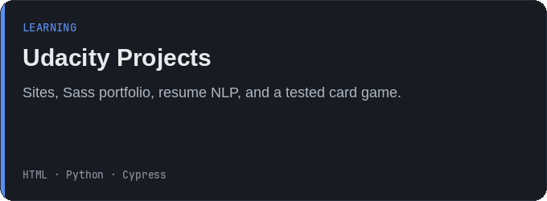</a>
      
<a href="https://github.com/ali-yaqoup/udacity-projects">Repository</a>

    </td>
    <td width="50%" valign="top">
      <a href="https://github.com/ali-yaqoup/hybrid-search-app">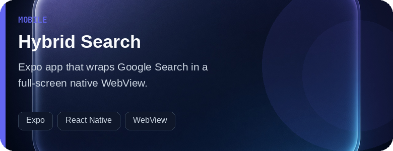</a>
      
<a href="https://github.com/ali-yaqoup/hybrid-search-app">Repository</a>

    </td>
  </tr>
</table>

 

### Experience & education

**Software Engineering Intern** — ITG Software, Inc.  
Shipped client-facing features and learned how production code is reviewed, tested, and released.

**B.Sc. Software Engineering** — An-Najah National University, Palestine  
Coursework supplemented with DataCamp study in data analysis and Python.

 

### Contact

[Portfolio](https://ali-yaqoup.github.io/Ali-Portfolio/)
·
[LinkedIn](https://www.linkedin.com/in/ali-derar-5679a8292)
·
[Email](mailto:ali.yaqoub.software@gmail.com)
·
[Linktree](https://linktr.ee/ali_yaqoup_dev)

   
  

## License & copyright

Copyright © 2026 Ali Yaqoub. All rights reserved.

This software and its contents are proprietary. Unauthorized copying, distribution, modification, or commercial use is prohibited without prior written permission from the copyright holder.
